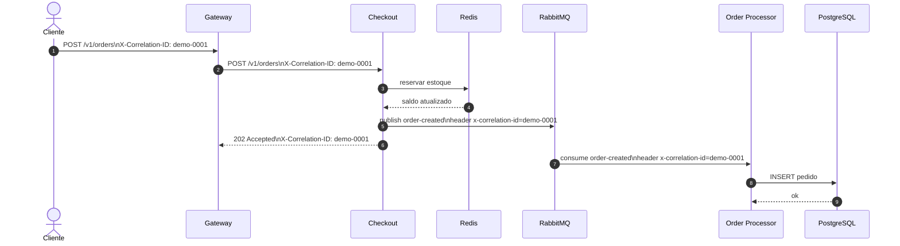
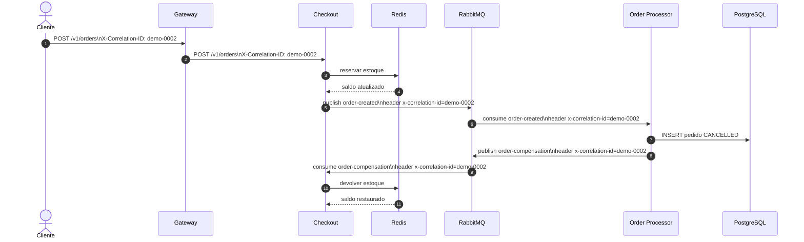

# Diagramas de sequência

## Sucesso

```mermaid
sequenceDiagram
    autonumber
    actor Cliente
    participant Gateway
    participant Checkout
    participant Redis
    participant RabbitMQ
    participant Processor as Order Processor
    participant DB as PostgreSQL

    Cliente->>Gateway: POST /v1/orders\nX-Correlation-ID: demo-0001
    Gateway->>Checkout: POST /v1/orders\nX-Correlation-ID: demo-0001
    Checkout->>Redis: reservar estoque
    Redis-->>Checkout: saldo atualizado
    Checkout->>RabbitMQ: publish order-created\nheader x-correlation-id=demo-0001
    Checkout-->>Gateway: 202 Accepted\nX-Correlation-ID: demo-0001
    RabbitMQ->>Processor: consume order-created\nheader x-correlation-id=demo-0001
    Processor->>DB: INSERT pedido
    DB-->>Processor: ok
```

## Compensação

```mermaid
sequenceDiagram
    autonumber
    actor Cliente
    participant Gateway
    participant Checkout
    participant Redis
    participant RabbitMQ
    participant Processor as Order Processor
    participant DB as PostgreSQL

    Cliente->>Gateway: POST /v1/orders\nX-Correlation-ID: demo-0002
    Gateway->>Checkout: POST /v1/orders\nX-Correlation-ID: demo-0002
    Checkout->>Redis: reservar estoque
    Redis-->>Checkout: saldo atualizado
    Checkout->>RabbitMQ: publish order-created\nheader x-correlation-id=demo-0002
    RabbitMQ->>Processor: consume order-created\nheader x-correlation-id=demo-0002
    Processor->>DB: INSERT pedido CANCELLED
    Processor->>RabbitMQ: publish order-compensation\nheader x-correlation-id=demo-0002
    RabbitMQ->>Checkout: consume order-compensation\nheader x-correlation-id=demo-0002
    Checkout->>Redis: devolver estoque
    Redis-->>Checkout: saldo restaurado
```

